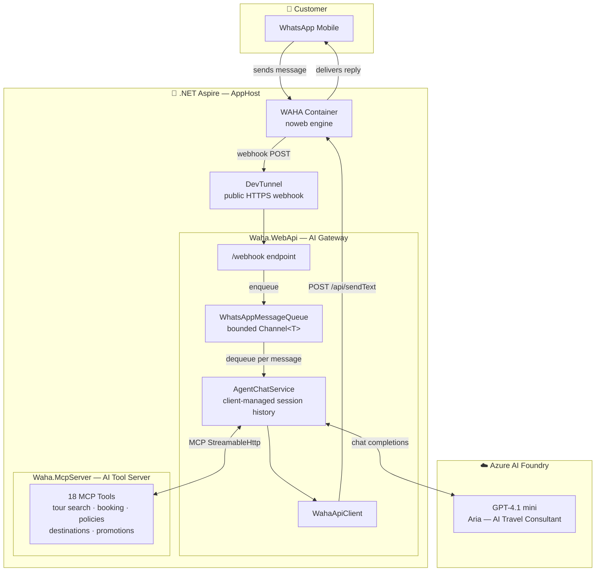

# Royal Journeys — TravelAgencySaaS

[](LICENSE)
[](https://dotnet.microsoft.com/)
[](https://learn.microsoft.com/en-us/dotnet/aspire/)
[](https://waha.devlike.pro/)

**Royal Journeys** is an open-source, AI-powered WhatsApp chatbot for travel agencies — built as both a **production-ready starter template** and a **reference implementation** showing how to wire together:

- **.NET Aspire** for full-stack cloud-native orchestration
- **WAHA** (WhatsApp HTTP API) as a self-hosted WhatsApp gateway
- **Microsoft Agents Framework** (MAF) for the AI agent runtime
- **Model Context Protocol (MCP)** for a structured, extensible AI tool server
- **Azure AI Foundry** (GPT-4.1 mini) as the LLM backend

Clone it, swap in your own tour catalog, configure your credentials, and you have a live WhatsApp bot — **Aria** — that can search tours, quote prices, capture booking inquiries, and send departure reminders to your customers.

---

## Architecture



### Message Flow (step by step)

1. Customer sends a WhatsApp message to the agency number
2. WAHA receives it and POSTs a webhook to the public DevTunnel URL
3. `/webhook` endpoint enqueues the message into a bounded `Channel<T>` (backpressure-safe)
4. `WhatsAppMessageQueue` dequeues and calls `AgentChatService`
5. `AgentChatService` restores the customer's conversation session (in-memory, keyed by phone number)
6. **Aria** (the `ChatClientAgent`) runs via `TravelAgentFactory` — calls MCP tools as needed
7. `Waha.McpServer` executes the requested tools (tour search, pricing, booking inquiry, etc.)
8. Aria crafts a WhatsApp-friendly reply and `WahaApiClient` delivers it back via WAHA

Alongside the live chat, `SchedulerService` fires departure reminders (7 days, 1 day, day-of) and post-trip feedback requests to booked customers.

---

## Technology Stack

| Layer | Technology | Purpose |
|---|---|---|
| **Runtime** | .NET 10 / C# 13 | All projects |
| **Orchestration** | [.NET Aspire 13.3](https://learn.microsoft.com/en-us/dotnet/aspire/) | Service discovery, health checks, OpenTelemetry, DevTunnel, secrets |
| **WhatsApp Gateway** | [WAHA](https://waha.devlike.pro/) (`devlikeapro/waha:noweb`) | Self-hosted WhatsApp HTTP API — no WhatsApp Business API fees |
| **AI Agent Runtime** | [Microsoft Agents Framework 1.5](https://github.com/microsoft/agents) | `ChatClientAgent`, `AgentSession`, client-managed conversation history |
| **LLM** | [Azure AI Foundry](https://azure.microsoft.com/en-us/products/ai-foundry/) (GPT-4.1 mini) | Chat completions backing the Aria agent |
| **AI Tool Protocol** | [Model Context Protocol 1.3](https://modelcontextprotocol.io/) | Structured HTTP-based tool server, auto-discovered by the agent |
| **Resilience** | [Microsoft.Extensions.Http.Resilience](https://learn.microsoft.com/en-us/dotnet/core/resilience/) (Polly v8) | Circuit breaker, timeouts — retries intentionally disabled to prevent duplicate messages |
| **Observability** | OpenTelemetry + Aspire Dashboard | Traces, structured logs, metrics across all services |
| **Public Tunnel** | [Azure DevTunnel](https://learn.microsoft.com/en-us/azure/developer/dev-tunnels/) | Exposes the local webhook to the internet for WAHA to call |

---

## MCP Tools (Waha.McpServer)

All AI tools live in `Waha.McpServer` and are exposed over **MCP StreamableHttp**. The AI agent discovers and calls them automatically — no tool registration needed in `Waha.WebApi`.

| Category | Tool | Description |
|---|---|---|
| **Tour Search** | `search_tours` | Search by destination, keyword, budget, or travel month |
| | `get_tour_details` | Full tour details — highlights, inclusions, exclusions, reviews |
| | `check_tour_availability` | Remaining slots for a tour in a given month |
| | `get_tour_pricing` | Detailed cost breakdown by room type (single/double/triple) |
| **Booking** | `create_booking_inquiry` | Register a customer booking inquiry with all details |
| | `get_booking_inquiries` | Retrieve a customer's existing inquiries by phone number |
| **Post-Booking** | `get_itinerary` | Day-by-day travel program |
| | `get_pre_departure_checklist` | Documents, health prep, and day-of instructions |
| | `submit_trip_feedback` | Collect a star rating and comment after the trip |
| | `get_tour_reviews` | Customer reviews and average rating for a tour |
| **Policies** | `get_cancellation_policy` | Refund tiers based on days before departure |
| | `get_tour_inclusions` | What is and is not included in a package |
| | `get_faq` | Frequently asked questions |
| **Destinations & Promotions** | `get_destination_guide` | Best season, weather, local attractions, cuisine |
| | `get_visa_requirements` | Visa and travel permit info per destination |
| | `get_packing_list` | Packing list tailored to destination and month |
| | `get_active_promotions` | Current active offers and discounts |
| | `calculate_group_discount` | Group pricing based on passenger count |

**MCP Resources** (read-only context injected into the agent):

| Resource | URI | Description |
|---|---|---|
| Tour Catalog | `tour://catalog` | Complete list of all available tour packages |
| Popular Destinations | `destination://popular` | Overview of all supported destinations |
| Company Policies | `company://policies` | Cancellation policy, group discounts, contact info |

---

## Project Structure

```
TravelAgencySaaS/
├── Waha.AppHost/          # .NET Aspire orchestration — defines all resources, dependencies, secrets
├── Waha.ServiceDefaults/  # Shared defaults — OpenTelemetry, health checks, HTTP resilience, service discovery
├── Waha.Hosting/          # Custom Aspire integration for the WAHA container (AddWaha extension)
├── Waha.McpServer/        # MCP tool server — 18 AI tools, 3 resources, in-memory data services
│   ├── Tools/             #   TourSearchTools, BookingInquiryTools, PostBookingTools, PolicyTools, DestinationTools, PromotionTools
│   ├── Resources/         #   TravelResources (MCP resources)
│   ├── Services/          #   TourCatalogService, BookingInquiryService, DestinationService, PromotionService, PolicyService
│   └── Data/              #   JSON seed data (tour catalog, destinations, policies)
└── Waha.WebApi/           # AI gateway — receives webhooks, runs the Aria agent, sends WhatsApp replies
    ├── Endpoints/         #   WebhookEndpoint (/webhook)
    ├── Services/          #   AgentChatService, TravelAgentFactory, WahaApiClient, WebhookRegistrationService, McpClientProvider
    ├── Queue/             #   WhatsAppMessageQueue (bounded Channel<T> background service)
    ├── Scheduling/        #   SchedulerService (departure reminders, post-trip feedback)
    ├── Handlers/          #   TravelBotHandler (scheduled notifications), FeedbackHandler
    └── Constants/         #   SystemPrompts.Aria (the agent's persona and instructions)
```

---

## Prerequisites

| Requirement | Version | Notes |
|---|---|---|
| [.NET SDK](https://dotnet.microsoft.com/download) | 10.0+ | `dotnet --version` to verify |
| [Docker Desktop](https://www.docker.com/products/docker-desktop/) | Latest | Required to run the WAHA container |
| [Aspire CLI](https://learn.microsoft.com/en-us/dotnet/aspire/fundamentals/aspire-sdk-tooling) | 13.3+ | `dotnet tool install -g aspire` |
| [Azure DevTunnel CLI](https://learn.microsoft.com/en-us/azure/developer/dev-tunnels/get-started) | Latest | `devtunnel user login` before running |
| [Azure AI Foundry](https://azure.microsoft.com/en-us/products/ai-foundry/) | — | Deployed GPT-4.1 mini (or compatible model) |
| WAHA API Key | — | Any string — you set this yourself in secrets |

---

## Quick Start

### 1. Clone the repository

```bash
git clone https://github.com/goldytech/TravelAgencySaaS.git
cd TravelAgencySaaS
```

### 2. Configure secrets

All sensitive values are stored in .NET user secrets (never committed to source control).

```bash
# Set WAHA credentials (choose your own values)
cd Waha.AppHost
dotnet user-secrets set "Parameters:wahaApiKey"            "your-api-key"
dotnet user-secrets set "Parameters:wahaDashboardPassword" "your-dashboard-password"
dotnet user-secrets set "Parameters:wahaSwaggerPassword"   "your-swagger-password"

# Set Azure AI Foundry connection string
# Format: Endpoint=https://<resource>.services.ai.azure.com/models;Key=<key>
dotnet user-secrets set "ConnectionStrings:ai-foundry" "Endpoint=https://...;Key=...;"
```

> **Tip:** The `wahaApiKey` is a secret you invent — it protects the WAHA REST API. Use the same value everywhere.

### 3. Log in to DevTunnel

```bash
devtunnel user login
```

### 4. Start the application

```bash
aspire start
```

Aspire will:
- Pull and start the WAHA Docker container (first run downloads ~500 MB)
- Start `Waha.McpServer` and `Waha.WebApi`
- Create a DevTunnel and register the webhook URL with WAHA automatically

Open the Aspire Dashboard link printed in the terminal to monitor all services.

### 5. Connect WhatsApp (scan QR)

Follow the **WAHA Dashboard Configuration** section below to link your WhatsApp account.

---

## WAHA Dashboard Configuration

WAHA exposes a management dashboard to connect your WhatsApp account.

### Access the dashboard

1. In the Aspire Dashboard, find the **waha** container resource
2. Click the **WAHA Dashboard** link (opens `http://localhost:<port>/dashboard`)
3. Log in with the `wahaDashboardPassword` you configured in secrets

### Create and start a session

1. Click **New Session** and name it `default` (the code uses this name)
2. Set the engine to **NOWEB** (browser-less, more reliable)
3. Click **Start** — the session status will change to `STARTING`

### Link your WhatsApp account

1. Once status reaches `SCAN QR CODE`, click the QR icon
2. On your phone: **WhatsApp → Linked Devices → Link a Device**
3. Scan the QR code
4. Status changes to `WORKING` — your bot is live ✅

### Session persistence

The container uses a **Persistent lifetime** in Aspire, meaning it survives `aspire stop` / `aspire start` cycles. The WAHA session (WhatsApp auth) is stored in a Docker volume (`waha-sessions`). On restarts, `WebhookRegistrationService` automatically re-registers the webhook and starts the session if it was stopped.

> **Troubleshooting:** If the session shows `STOPPED`, the service starts it automatically on the next `aspire start`. You can also trigger it manually via the WAHA Dashboard → Session → Start.

---

## Configuration Reference

All configuration is passed through Aspire's parameter/environment system and stored in user secrets.

| Secret / Env Var | Where set | Description |
|---|---|---|
| `Parameters:wahaApiKey` | `Waha.AppHost` user secrets | API key protecting the WAHA REST endpoints |
| `Parameters:wahaDashboardPassword` | `Waha.AppHost` user secrets | WAHA Dashboard login password |
| `Parameters:wahaSwaggerPassword` | `Waha.AppHost` user secrets | WAHA Swagger UI login password |
| `ConnectionStrings:ai-foundry` | `Waha.AppHost` user secrets | Azure AI Foundry connection string (`Endpoint=...;Key=...`) |
| `WEBHOOK_BASE_URL` | Optional env var on `Waha.WebApi` | Override the webhook URL if not using DevTunnel |

---

## Customising for Your Agency

### Replace the tour catalog

Edit the JSON data files in `Waha.McpServer/Data/`:

- `tours.json` — tour packages (name, destination, duration, price, tags, highlights)
- `destinations.json` — destination guides
- `policies.json` — cancellation tiers, group discounts, contact info

### Change the AI persona

Edit `Waha.WebApi/Constants/SystemPrompts.cs` — the `Aria` constant is the full system prompt. Rename the agent, adjust the personality, and update the upsell/lead-capture instructions to match your agency.

### Add new MCP tools

1. Create a new `*Tools.cs` class in `Waha.McpServer/Tools/` decorated with `[McpServerToolType]`
2. Add `[McpServerTool]` methods — they are auto-registered via `WithToolsFromAssembly`
3. Inject any services you need through the constructor — standard DI applies

No changes needed in `Waha.WebApi` — the agent discovers new tools on startup.

---

## Contributing

Contributions are welcome! Please follow these steps:

1. **Open an issue** first to discuss the change (bug, feature, or improvement)
2. **Fork** the repository and create a branch:
   ```
   git checkout -b feat/<issue-number>-short-description
   ```
3. Make your changes following the existing code style:
   - C# 13 features where appropriate (`System.Threading.Lock`, collection expressions, etc.)
   - Primary constructors for services
   - `ConfigureAwait(false)` on all `await` calls in library/service code
   - No `#pragma warning disable` — fix the root cause instead
4. **Build and verify** with `dotnet build` (zero warnings expected)
5. Open a **Pull Request** — reference the issue in the PR description

### Code style highlights

- Services are registered as `Singleton` or `Scoped` — never `Transient` for stateful classes
- HTTP clients use `IHttpClientFactory` (typed or named) — no `new HttpClient()`
- Background work uses `Channel<T>` or `IHostedService` — no `_ = Task.Run(...)`
- Retries are intentionally disabled on `WahaApiClient` — retrying a `sendText` sends duplicate WhatsApp messages

---

## License

This project is licensed under the [MIT License](LICENSE).

© 2026 Muhammad Afzal Qureshi
