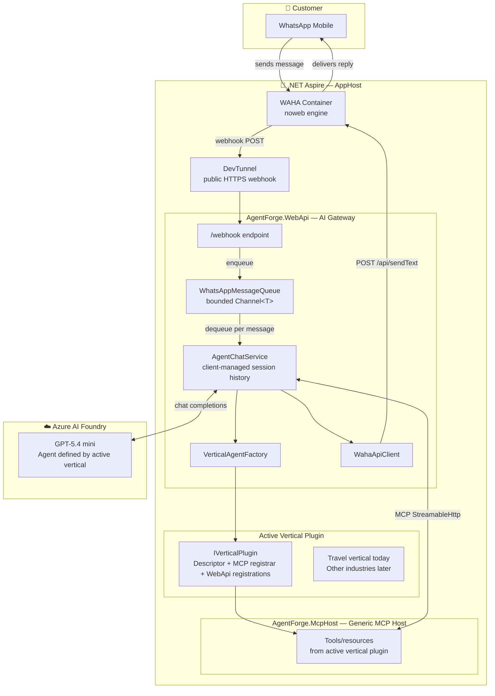

# AgentForge — Multi-Vertical WhatsApp AI Platform

[](LICENSE)
[](https://dotnet.microsoft.com/)
[](https://learn.microsoft.com/en-us/dotnet/aspire/)
[](https://waha.devlike.pro/)
[](https://github.com/goldytech/whatsapp-ai-travel-agent)

> ⭐ If this project saves you time or inspires your work, please **[give it a star](https://github.com/goldytech/whatsapp-ai-travel-agent)** — it helps others discover it and keeps the momentum going!

## Demo


**AgentForge** is an open-source WhatsApp AI platform for service businesses. It gives you a reusable host runtime for WhatsApp messaging, agent orchestration, MCP tool execution, and Aspire-based local deployment — while letting each industry vertical plug in its own tools, prompts, workflows, and data.

The current in-tree vertical is **travel** (`AgentForge.Verticals.Travel`), which acts as both:

- the working reference implementation
- the first commercial wedge
- the example of how AgentForge can later extend into industries such as salons, clinics, restaurants, or other service businesses

Today, you can clone the repo, configure the secrets, and run the travel experience end to end. Under the hood, though, the architecture is already oriented around **dynamic vertical plugins**, not a permanently travel-only codebase.

---

## Architecture



### Message Flow (step by step)

1. Customer sends a WhatsApp message to the business number
2. WAHA receives it and POSTs a webhook to the public DevTunnel URL
3. `AgentForge.WebApi` verifies the WAHA HMAC signature and enqueues the message into a bounded `Channel<T>`
4. `WhatsAppMessageQueue` dequeues and calls `AgentChatService`
5. `AgentChatService` restores the customer's conversation session (in-memory, keyed by phone number)
6. `VerticalAgentFactory` initializes the agent using the active vertical descriptor and prompt
7. `AgentForge.McpHost` loads tools/resources from the selected vertical assembly and executes requested MCP calls
8. The active vertical shapes the conversation behavior, available tools, preview metadata, and scheduled action handling
9. `WahaApiClient` delivers the WhatsApp-friendly reply back through WAHA

Alongside the live chat, `SchedulerService` dispatches generic scheduled actions to the active vertical's `IScheduledActionHandler` implementation.

---

## Technology Stack

| Layer | Technology | Purpose |
|---|---|---|
| **Runtime** | .NET 10 / C# 14 | All projects |
| **Orchestration** | [.NET Aspire 13.3](https://learn.microsoft.com/en-us/dotnet/aspire/) | Service discovery, health checks, OpenTelemetry, DevTunnel, secrets |
| **WhatsApp Gateway** | [WAHA](https://waha.devlike.pro/) (`devlikeapro/waha:noweb`) | Self-hosted WhatsApp HTTP API — no WhatsApp Business API fees |
| **AI Agent Runtime** | [Microsoft Agents Framework 1.5](https://github.com/microsoft/agents) | `ChatClientAgent`, `AgentSession`, client-managed conversation history |
| **LLM** | [Azure AI Foundry](https://azure.microsoft.com/en-us/products/ai-foundry/) (GPT-5.4 mini) | Chat completions backing the active vertical agent |
| **AI Tool Protocol** | [Model Context Protocol 1.3](https://modelcontextprotocol.io/) | Structured HTTP-based tool server, auto-discovered by the agent |
| **Resilience** | [Microsoft.Extensions.Http.Resilience](https://learn.microsoft.com/en-us/dotnet/core/resilience/) (Polly v8) | Circuit breaker, timeouts — retries intentionally disabled to prevent duplicate messages |
| **Observability** | OpenTelemetry + Aspire Dashboard | Traces, structured logs, metrics across all services |
| **Public Tunnel** | [Azure DevTunnel](https://learn.microsoft.com/en-us/azure/developer/dev-tunnels/) | Exposes the local webhook to the internet for WAHA to call |

---

## Dynamic MCP Tool Wiring

`AgentForge.McpHost` is a **generic MCP host**. It does not permanently own travel logic anymore. Instead:

1. a vertical plugin exposes an `IVerticalPlugin`
2. that plugin exposes an `IVerticalMcpRegistrar`
3. the registrar points the host at the assembly containing the vertical's tools/resources
4. `AgentForge.McpHost` registers those tools/resources at runtime

The current shipped vertical is `src/Verticals/AgentForge.Verticals.Travel/`, so the live toolset below is the **travel example vertical**, not the hard limit of the platform.

### Current travel vertical tools

| Category | Tool | Description |
|---|---|---|
| **Tour Search** | `search_tours` | Search by destination, keyword, budget, or travel month |
| | `get_tour_details` | Full tour details — highlights, inclusions, exclusions, reviews |
| | `check_availability` | Remaining slots for a tour in a given month |
| | `get_pricing_breakdown` | Detailed cost breakdown by room type (single/double/triple) |
| **Booking** | `create_booking_inquiry` | Register a customer booking inquiry with all details |
| | `get_customer_inquiries` | Retrieve a customer's existing inquiries by phone number |
| **Post-Booking** | `get_day_by_day_itinerary` | Day-by-day travel program |
| | `get_departure_checklist` | Documents, health prep, and day-of instructions |
| | `submit_trip_feedback` | Collect a star rating and comment after the trip |
| | `get_tour_reviews` | Customer reviews and average rating for a tour |
| **Policies** | `get_cancellation_policy` | Refund tiers based on days before departure |
| | `get_inclusions_exclusions` | What is and is not included in a package |
| | `get_faq_answer` | Frequently asked questions |
| **Destinations & Promotions** | `get_destination_guide` | Best season, weather, local attractions, cuisine |
| | `get_visa_requirements` | Visa and travel permit info per destination |
| | `get_packing_recommendations` | Packing list tailored to destination and month |
| | `get_active_promotions` | Current active offers and discounts |
| | `calculate_group_discount` | Group pricing based on passenger count |

### Current travel vertical resources

| Resource | URI | Description |
|---|---|---|
| Tour Catalog | `tour://catalog` | Complete list of all available tour packages |
| Popular Destinations | `destination://popular` | Overview of all supported destinations |
| Company Policies | `company://policies` | Cancellation policy, group discounts, contact info |

---

## Project Structure

```text
whatsapp-ai-travel-agent/
├── AgentForge.slnx
├── src/
│   ├── AgentForge.AppHost/          # .NET Aspire orchestration — defines all resources, dependencies, secrets
│   ├── AgentForge.ServiceDefaults/  # Shared defaults — OpenTelemetry, health checks, HTTP resilience, service discovery
│   ├── AgentForge.Hosting/          # Custom Aspire integration for the WAHA container (AddWaha extension)
│   ├── AgentForge.Verticals.Abstractions/ # Shared contracts for vertical metadata, messaging, and scheduled actions
│   ├── AgentForge.Verticals.Hosting/ # Shared loader boundary used by both hosts to resolve the active vertical
│   ├── AgentForge.McpHost/          # Generic MCP host — loads tools/resources from the active vertical plugin
│   ├── AgentForge.WebApi/           # AI gateway — receives webhooks, runs the active vertical agent, sends WhatsApp replies
│   │   ├── Endpoints/               #   WebhookEndpoint (/webhook), PreviewEndpoint (/preview)
│   │   ├── Services/                #   AgentChatService, VerticalAgentFactory, WahaApiClient, WebhookRegistrationService, McpClientProvider
│   │   ├── Queue/                   #   WhatsAppMessageQueue (bounded Channel<T> background service)
│   │   └── Scheduling/              #   SchedulerService (generic scheduled action dispatcher)
│   └── Verticals/
│       └── AgentForge.Verticals.Travel/ # Travel plugin: config pack, prompt, tools, resources, services, data, scheduled actions
├── tests/                           # Reserved for upcoming test projects
└── artifacts/                       # Reserved for build and plugin outputs
```

---

## How AgentForge Extends to Other Industries

This repository is now structured so the **host runtime stays generic** while each industry vertical owns its own domain behavior.

### Generic platform pieces

- `AgentForge.AppHost` — Aspire orchestration, secrets, WAHA container, DevTunnel, MCP Inspector, Compose publish flow
- `AgentForge.WebApi` — webhook handling, session management, queueing, agent execution, WAHA sending, preview serving
- `AgentForge.McpHost` — generic MCP host that loads tools/resources from the active vertical
- `AgentForge.Verticals.Abstractions` — shared plugin contracts such as `IVerticalPlugin`, `IVerticalDescriptor`, `IVerticalMcpRegistrar`, and `IScheduledActionHandler`
- `AgentForge.Verticals.Hosting` — default and `AssemblyLoadContext`-based plugin loaders

### Vertical-owned pieces

Each vertical can own:

- runtime config packs, prompts, and branding
- MCP tools and MCP resources
- domain services/models
- industry seed data
- scheduled action behavior
- WebApi service registrations specific to that industry

### Current plugin contract

At a high level, a vertical plugs in by implementing:

- `IVerticalDescriptor` — runtime-composed display name, agent metadata, system prompt, preview defaults, asset prefix
- `IVerticalMcpRegistrar` — which assembly contains the vertical's MCP tools/resources and which services to register for MCP
- `IVerticalPlugin` — configuration sources, common services, runtime descriptor creation, MCP registrar, and WebApi service registration
- `IScheduledActionHandler` — industry-specific reminder/follow-up behavior

### Runtime selection model

AgentForge supports three runtime modes today:

1. **Default fallback** — if no plugin env vars are set, both hosts use the in-tree travel plugin
2. **Direct path** — set `VERTICAL_PLUGIN_PATH` to an external plugin folder or DLL
3. **Plugin root + id** — set `VERTICAL_PLUGIN_ROOT` and `VERTICAL_ID` so the loader resolves `<root>/<id>`

### Creating a new industry vertical

To add a new industry such as salon, clinic, or restaurant:

1. create a new class library under `src/Verticals/AgentForge.Verticals.<Vertical>/`
2. implement the vertical descriptor, MCP registrar, plugin entry point, and scheduled action handler
3. place that vertical's tools/resources/services/data in the new assembly
4. publish it to `artifacts/plugins/<vertical-id>/`
5. point `VERTICAL_PLUGIN_PATH` or `VERTICAL_PLUGIN_ROOT` + `VERTICAL_ID` at it

The result is the same generic WhatsApp host runtime with a different business-specific capability set loaded at runtime.

---

## Prerequisites

| Requirement | Version | Notes |
|---|---|---|
| [.NET SDK](https://dotnet.microsoft.com/download) | 10.0+ | `dotnet --version` to verify |
| [Docker Desktop](https://www.docker.com/products/docker-desktop/) | Latest | Required to run the WAHA container |
| [Aspire CLI](https://learn.microsoft.com/en-us/dotnet/aspire/fundamentals/aspire-sdk-tooling) | 13.3+ | `dotnet tool install -g aspire` |
| [Azure DevTunnel CLI](https://learn.microsoft.com/en-us/azure/developer/dev-tunnels/get-started) | Latest | `devtunnel user login` before running |
| [Azure AI Foundry](https://azure.microsoft.com/en-us/products/ai-foundry/) | — | Deployed GPT-5.4 mini (or compatible model) |
| WAHA API Key | — | Any string — you set this yourself in secrets |

---

## Quick Start

### 1. Clone the repository

```bash
git clone https://github.com/goldytech/whatsapp-ai-travel-agent.git
cd whatsapp-ai-travel-agent
```

### 2. Configure secrets

All sensitive values are stored in .NET user secrets (never committed to source control).

```bash
# Set WAHA credentials (choose your own values)
cd src/AgentForge.AppHost
dotnet user-secrets set "Parameters:wahaApiKey"            "your-api-key"
dotnet user-secrets set "Parameters:wahaDashboardPassword" "your-dashboard-password"
dotnet user-secrets set "Parameters:wahaSwaggerPassword"   "your-swagger-password"
dotnet user-secrets set "Parameters:wahaWebhookSecret"     "generate-a-long-random-secret-here"

# Set Azure AI Foundry connection string
# Format: Endpoint=https://<resource>.services.ai.azure.com/models;Key=<key>
dotnet user-secrets set "ConnectionStrings:ai-foundry" "Endpoint=https://...;Key=...;"
```

> **Tip:** The `wahaApiKey` protects the WAHA REST API. `wahaWebhookSecret` is a separate shared secret used for WAHA's HMAC-signed webhook delivery to `/webhook`. Keep them different.

### 3. Log in to DevTunnel

```bash
devtunnel user login
```

### 4. Start the application

```bash
aspire start
```

Aspire will:
- Pull and start the WAHA Docker container (first run downloads ~500 MB)
- Start `AgentForge.McpHost` and `AgentForge.WebApi`
- Create a DevTunnel and register the webhook URL with WAHA automatically

Open the Aspire Dashboard link printed in the terminal to monitor all services.

### 5. Connect WhatsApp (scan QR)

Follow the **WAHA Dashboard Configuration** section below to link your WhatsApp account.

---

## WAHA Dashboard Configuration

WAHA exposes a management dashboard to connect your WhatsApp account.

### Access the dashboard

1. In the Aspire Dashboard, find the **waha** container resource
2. Click the **WAHA Dashboard** link (opens `http://localhost:<port>/dashboard`)
3. Log in with the `wahaDashboardPassword` you configured in secrets

### Create and start a session

1. Click **New Session** and name it `default` (the code uses this name)
2. Set the engine to **NOWEB** (browser-less, more reliable)
3. Click **Start** — the session status will change to `STARTING`

### Link your WhatsApp account

1. Once status reaches `SCAN QR CODE`, click the QR icon
2. On your phone: **WhatsApp → Linked Devices → Link a Device**
3. Scan the QR code
4. Status changes to `WORKING` — your bot is live ✅

### Session persistence

The container uses a **Persistent lifetime** in Aspire, meaning it survives `aspire stop` / `aspire start` cycles. The WAHA session (WhatsApp auth) is stored in a Docker volume (`waha-sessions`). On restarts, `WebhookRegistrationService` automatically re-registers the webhook and starts the session if it was stopped.

> **Troubleshooting:** If the session shows `STOPPED`, the service starts it automatically on the next `aspire start`. You can also trigger it manually via the WAHA Dashboard → Session → Start.

### Webhook authenticity

WAHA webhooks are configured with an HMAC secret and `AgentForge.WebApi` verifies every `/webhook` request against the raw request body before any JSON is parsed.

- WAHA sends `X-Webhook-Hmac`
- WAHA sends `X-Webhook-Hmac-Algorithm`
- The app currently accepts `sha512` only, matching WAHA's documented behavior
- Invalid or unsigned webhook requests are rejected before they reach the message queue

The manual `POST /admin/register-webhook` endpoint is available in **Development** only.

---

## MCP Inspector

The [MCP Inspector](https://github.com/modelcontextprotocol/inspector) is a browser-based developer tool for interactively exploring and testing the tools and resources exposed by `AgentForge.McpHost`. It is included automatically in the Aspire application when running locally — no separate install required.

### Open the inspector

1. Run `aspire start` and open the **Aspire Dashboard** link printed in the terminal
2. Find the **mcp-inspector** resource and click its **Client** endpoint link
3. The inspector opens in your browser at `http://localhost:6274`

### Connect to the MCP server

1. In the **Transport Type** dropdown, select **Streamable HTTP**
2. The **Server URL** field will be pre-filled with the local `AgentForge.McpHost` endpoint (e.g. `http://localhost:<port>/mcp`)
3. Click **Connect**, then click **Initialize**
4. You can now browse all **18 tools** and **3 resources** — execute them with custom arguments and inspect the responses in real time

### Node.js v24 compatibility note

The default inspector version (`0.17.2`) crashes on Node.js v24+ with `ERR_INVALID_STATE: Controller is already closed`. The AppHost pins the inspector to `0.17.5` which includes the fix:

```csharp
// AgentForge.AppHost/AppHost.cs
builder.AddMcpInspector("mcp-inspector", options =>
{
    options.InspectorVersion = "0.17.5";
}).WithMcpServer(mcpServer);
```

If you upgrade the `CommunityToolkit.Aspire.Hosting.McpInspector` package in the future, verify the bundled default version is `0.17.5` or later before removing the explicit pin.

---

## Configuration Reference

Secrets stay in AppHost user secrets. Customer-facing branding, prompt text, and business-profile settings can be layered from a mounted config folder without recompiling the travel plugin.

Aspire parameters are used for **promptable runtime inputs**. Graph-shaping AppHost values stay as ordinary configuration so the resource graph can be built deterministically before the dashboard starts.

| Secret / Env Var | Where set | Description |
|---|---|---|
| `Parameters:wahaApiKey` | `AgentForge.AppHost` user secrets | API key protecting the WAHA REST endpoints |
| `Parameters:wahaDashboardPassword` | `AgentForge.AppHost` user secrets | WAHA Dashboard login password |
| `Parameters:wahaSwaggerPassword` | `AgentForge.AppHost` user secrets | WAHA Swagger UI login password |
| `Parameters:wahaWebhookSecret` | `AgentForge.AppHost` user secrets | Shared secret used by WAHA to HMAC-sign webhook POST bodies |
| `ConnectionStrings:ai-foundry` | `AgentForge.AppHost` user secrets | Azure AI Foundry connection string (`Endpoint=...;Key=...`) |
| `WahaTier` | `AgentForge.AppHost` user secrets | `Core` (default, free) or `Plus` (paid, enables native image/file/voice sending); kept as AppHost config because it also selects the WAHA container tier/image |
| `WEBHOOK_BASE_URL` | Optional env var on `AgentForge.WebApi` | Override the webhook URL if not using DevTunnel |
| `VERTICAL_ID` | Optional env var on `AgentForge.AppHost` | Active vertical ID for Compose publishing and runtime selection (`travel` by default) |
| `VERTICAL_PLUGIN_ROOT` | Optional env var on `AgentForge.AppHost` | Container-side root path mounted into `AgentForge.WebApi` and `AgentForge.McpHost` during Compose publish (`/app/plugins` by default) |
| `VERTICAL_PLUGIN_SOURCE_PATH` | Optional env var on `AgentForge.AppHost` | Host-side plugin folder to bind-mount during Compose publish (defaults to `../../artifacts/plugins/{VERTICAL_ID}` relative to `src/AgentForge.AppHost/`) |
| `CUSTOMER_CONFIG_SOURCE_PATH` | Optional env var on `AgentForge.AppHost` | Host-side customer config folder to bind-mount during Compose publish; when set, the AppHost also passes `CUSTOMER_CONFIG_PATH` into both hosts |
| `CUSTOMER_CONFIG_PATH` | Optional env var on `AgentForge.WebApi` / `AgentForge.McpHost` | Path to a customer config folder containing `customer-profile.json` and optionally `prompt.md`; when unset, the travel plugin falls back to its bundled defaults |
| `VERTICAL_PLUGIN_PATH` | Optional env var on `AgentForge.WebApi` / `AgentForge.McpHost` | Path to an external published vertical plugin folder or DLL; when unset, the in-tree travel plugin is used |

### Optional dashboard local overrides

When you run `aspire start` locally, the AppHost exposes these as Aspire parameters:

- `vertical-plugin-path` — optional local override for an external plugin folder or DLL
- `customer-config-path` — optional local override for a customer config folder

They default to blank, so local startup no longer blocks on unresolved parameters. Blank means:

- built-in in-tree travel plugin
- bundled travel customer config

If you want to preconfigure these overrides without using the dashboard, the canonical Aspire parameter keys are `Parameters:vertical-plugin-path` and `Parameters:customer-config-path`. For env-style configuration, the AppHost also accepts these shell-friendly aliases:

- `Parameters__vertical_plugin_path`
- `Parameters__customer_config_path`

Legacy `VERTICAL_PLUGIN_PATH` and `CUSTOMER_CONFIG_PATH` environment variables are still accepted as compatibility fallbacks for local runs.

The dashboard parameters are therefore an **optional override UX**, not a required setup step. In contrast, values like `VERTICAL_ID`, `VERTICAL_PLUGIN_SOURCE_PATH`, `CUSTOMER_CONFIG_SOURCE_PATH`, and `WahaTier` still shape the AppHost graph or publish output, so they remain standard AppHost configuration rather than dashboard-entered parameters.

### Customer config pack layout

The bundled travel defaults now live under:

```text
src/Verticals/AgentForge.Verticals.Travel/Configuration/
├── customer-profile.json
└── prompt.md
```

To onboard a customer without recompiling, mount a folder with the same shape and point `CUSTOMER_CONFIG_PATH` at it:

```text
customer-config/
├── customer-profile.json
└── prompt.md   # optional override; falls back to the bundled prompt if omitted
```

`customer-profile.json` is bound through the .NET Options pattern, so branding, MCP server name, preview text, lead-capture fields, capabilities, business hours, and handoff rules are strongly typed and validated on startup.

---

## WAHA Plus (Optional — Enables Native Image Sending)

By default the project runs on **WAHA Core** (free, `devlikeapro/waha:noweb`). Image messages fall back to a WhatsApp link-preview card — the URL is sent as text and WhatsApp renders a native preview.

To unlock **native image sending** (and file, voice, video support), upgrade to **WAHA Plus** ($19/month). No code changes are needed — the `IWahaSendService` strategy pattern switches implementations automatically based on the `WahaTier` config value.

### Steps to enable WAHA Plus

**1. Subscribe and obtain your Patron key**

Go to [https://portal.devlike.pro](https://portal.devlike.pro), subscribe to the Plus plan, and copy your **Patron key** from the dashboard.

**2. Authenticate with the WAHA private registry**

```bash
docker login -u devlikeapro -p <YOUR_PATRON_KEY>
```

This saves credentials to `~/.docker/config.json` — Docker Desktop will use them automatically.

**3. Pull the WAHA Plus image**

```bash
# Apple Silicon (ARM64)
docker pull devlikeapro/waha-plus:noweb-arm

# Intel / AMD64
docker pull devlikeapro/waha-plus:noweb
```

**4. Set the tier in Aspire user secrets**

```bash
cd src/AgentForge.AppHost
dotnet user-secrets set "WahaTier" "Plus"
```

**5. Restart the application**

```bash
aspire start
```

Aspire will now pull and start `devlikeapro/waha-plus:noweb` instead of the free image, and `PlusWahaSendService` will handle all message sending with native Plus APIs.

### Core vs Plus feature comparison

| Feature | Core (free) | Plus ($19/mo) |
|---|---|---|
| `sendText` | ✅ | ✅ |
| `sendText` with link preview | ✅ | ✅ |
| `sendImage` | ❌ (link-preview fallback) | ✅ |
| `sendFile` | ❌ | ✅ |
| `sendVoice` | ❌ | ✅ |
| `sendVideo` | ❌ | ✅ |
| `sendList` / `sendButtons` | ❌ (text fallback) | ✅ (WEBJS/WPP only, not NOWEB) |
| NOWEB engine (no Chrome) | ✅ | ✅ |

> **Note:** `sendList` and `sendButtons` require the WEBJS or WPP engine even in Plus. This project uses NOWEB for its low memory footprint (~50 MB vs ~250 MB for Chromium-based engines) and stability. Interactive menus are rendered as numbered emoji text lists, which works well for the current travel vertical and similar service-selection flows.

---

## Customising the Current Travel Vertical

### Replace the tour catalog

Edit the JSON data files in `src/Verticals/AgentForge.Verticals.Travel/Data/`:

- `TourCatalog.json` — tour packages (name, destination, duration, price, tags, highlights)
- `DestinationGuide.json` — destination guides (best season, visa, packing, attractions)
- `AgencyInfo.json` — cancellation tiers, group discounts, contact info
- `FAQ.json` — frequently asked questions
- `Promotions.json` — active promotional offers and discounts

### Change the AI persona

Edit the bundled config pack in `src/Verticals/AgentForge.Verticals.Travel/Configuration/`:

- `customer-profile.json` — display name, agent metadata, MCP server name, preview defaults, lead-capture fields, capabilities, business hours, handoff rules
- `prompt.md` — the long-form travel system prompt template

For customer onboarding, prefer an external folder plus `CUSTOMER_CONFIG_PATH` so you do not need to recompile the plugin.

### Add new MCP tools

1. Create a new `*Tools.cs` class in `src/Verticals/AgentForge.Verticals.Travel/Tools/` decorated with `[McpServerToolType]`
2. Add `[McpServerTool]` methods — they are auto-registered via `WithToolsFromAssembly`
3. Inject any services you need through the constructor — standard DI applies

No changes needed in `AgentForge.WebApi` — the agent discovers new tools on startup.

---

## Roadmap

The following improvements are planned or open for contribution. Each item is tracked as a GitHub Issue — check the [Issues tab](../../issues) for the current status.

### 🗄️ Persistence Layer — Azure Cosmos DB

Replace the current in-memory `*Service` singletons (`TourService`, `DestinationService`, etc.) with a durable data store backed by **Azure Cosmos DB**.

- Use the Aspire Cosmos DB integration for local development:
  ```csharp
  // AgentForge.AppHost/AppHost.cs
  var cosmos = builder.AddAzureCosmosDB("cosmos").RunAsEmulator();
  ```
- Ref: https://aspire.dev/integrations/cloud/azure/azure-cosmos-db/azure-cosmos-db-host/#run-as-emulator
- Persist conversation history (`AgentSessionStore`), vertical data packs, bookings, and lead data
- Enables multi-tenant data isolation and cross-restart state survival

### 🧪 Unit & Integration Tests

Add automated test coverage across all layers.

- **Unit tests** — one xUnit project per layer (`AgentForge.McpHost.Tests`, `AgentForge.WebApi.Tests`)
  - Mock `WahaApiClient`, `AgentChatService`, and MCP tool services
- **Integration tests** — use Aspire's `DistributedApplicationTestingBuilder`
  - Spin up the full AppHost in-process, send a webhook request, and assert the WhatsApp reply
- Ref: https://learn.microsoft.com/dotnet/aspire/testing/overview

### 🔐 OAuth / Authentication for MCP Server

Protect the `AgentForge.McpHost` `/mcp` endpoint with bearer token validation so that only authorised callers (the active vertical agent, MCP Inspector with a token) can invoke tools.

- Use ASP.NET Core JWT bearer middleware
- Configure allowed clients in `AgentForge.AppHost` user secrets
- The MCP C# SDK supports passing `Authorization` headers on the client side

### 🖥️ Admin Dashboard

A web UI (Blazor or React) for agency staff to:
- View and manage incoming booking enquiries
- Update business data, catalog items, and availability
- Monitor active WhatsApp conversations

### 💳 Payment Gateway Integration

Capture tour deposits directly in the chat flow:
- Integrate **Razorpay** (South Asia) or **Stripe** (global) via new MCP tools
- Generate payment links and send them over WhatsApp
- Webhook handler to confirm payment and update booking status

### 🏢 Multi-Tenant Support

Allow a single deployment to serve multiple businesses and vertical instances:
- Tenant resolution by WhatsApp number prefix or subdomain
- Isolated Cosmos DB containers per tenant
- Per-tenant vertical selection, system prompt, and business data pack
- Aspire parameter-driven secret namespacing

### ⚙️ CI/CD Pipeline

GitHub Actions workflow for:
- `dotnet build` on every PR (zero-warnings gate)
- Unit and integration test run
- Docker image build and push to Azure Container Registry
- Optional: auto-deploy to Azure Container Apps on merge to `main`

### 🐳 Container Deployment — Aspire-generated Docker Compose

The repository now supports **Aspire-generated Docker Compose** for VPS/self-hosted deployments.

#### Publish the travel plugin

```bash
dotnet publish src/Verticals/AgentForge.Verticals.Travel/AgentForge.Verticals.Travel.csproj
```

By default this writes the runtime-loadable travel plugin to:

```text
artifacts/plugins/travel/
```

#### Generate the Compose artifacts

```bash
aspire publish --apphost src/AgentForge.AppHost/AgentForge.AppHost.csproj -o artifacts/aspire-output
```

This generates:

- `artifacts/aspire-output/docker-compose.yaml`
- a Compose model containing `waha`, `mcpserver`, and `webhook`
- a persistent `waha-sessions` Docker volume
- bind mounts that project `artifacts/plugins/travel` into both app services at `/app/plugins/travel`
- optional read-only customer-config bind mounts when `CUSTOMER_CONFIG_SOURCE_PATH` is set

#### Deployment notes

- `AgentForge.WebApi` and `AgentForge.McpHost` receive `VERTICAL_ID`, `VERTICAL_PLUGIN_ROOT`, and `VERTICAL_PLUGIN_PATH` automatically in publish mode.
- If `CUSTOMER_CONFIG_SOURCE_PATH` is set on the AppHost, both hosts also receive `CUSTOMER_CONFIG_PATH` and the mounted folder is available read-only for runtime descriptor overrides.
- During local `aspire start`, `vertical-plugin-path` and `customer-config-path` are exposed as optional Aspire parameter overrides with friendly dashboard labels/placeholders, but they default to blank so normal startup does not require dashboard input.
- `DevTunnel` and `MCP Inspector` are intentionally **local-only** and are not included in published Compose output.
- The generated Compose file still expects environment variables for image names and secrets such as `WEBHOOK_IMAGE`, `MCPSERVER_IMAGE`, `AI_FOUNDRY`, `WAHAAPIKEY`, `WAHADASHBOARDPASSWORD`, and `WAHASWAGGERPASSWORD`.
- To publish a different vertical later, publish that plugin to `artifacts/plugins/<vertical-id>/` and set `VERTICAL_ID` (and optionally `VERTICAL_PLUGIN_SOURCE_PATH` and `CUSTOMER_CONFIG_SOURCE_PATH`) before running `aspire publish`.

### 🌐 Multi-Language / i18n

Detect the customer's language from their first message and instruct the active vertical agent to reply in kind:
- Add a language-detection step in `AgentChatService` before the agent prompt
- Update the system prompt to include the detected locale
- Fallback to English for unsupported languages

### 🛡️ Rate Limiting & WAHA Abuse Protection

Prevent message flooding at both the API and WAHA layers:
- **ASP.NET Core rate limiting middleware** on the `/webhook` endpoint (per-IP, sliding window)
- **WAHA-side throttling**: WAHA Pro supports send-rate limits — configure `WAHA_SEND_RATE_LIMIT` to avoid WhatsApp bans
- Per-phone-number cooldown in `WhatsAppMessageQueue` for repeat senders

### 📊 Analytics & Reporting

Track conversation quality and tour funnel metrics. Three complementary approaches:

| Approach | Best for | Notes |
|---|---|---|
| **Azure Application Insights** (recommended) | Teams already on Azure | Zero new infra — extends the existing OpenTelemetry pipeline in `ServiceDefaults`. Add `TelemetryClient.TrackEvent("TourBooked", props)` in `AgentChatService`. Dashboards in Azure Portal / Workbooks. |
| **Grafana + OpenTelemetry** | Open-source stack | Aspire already exports OTLP. Add a Grafana container resource in `AgentForge.AppHost` and route traces/metrics there — no SaaS dependency. |
| **Custom built-in dashboard** | Full control | Store aggregated metrics in Cosmos DB (when added) and build a Blazor dashboard. Most effort, zero external dependency. |

Suggested events to track: `MessageReceived`, `TourEnquiry`, `TourBooked`, `PaymentCaptured`, `AgentError`.

---

## Contributing

Contributions are welcome! Please follow these steps:

1. **Open an issue** first to discuss the change (bug, feature, or improvement)
2. **Fork** the repository and create a branch:
   ```
   git checkout -b feat/<issue-number>-short-description
   ```
3. Make your changes following the existing code style:
   - C# 14 features where appropriate (`field`-backed properties, extension members, `System.Threading.Lock`, collection expressions, etc.)
   - Primary constructors for services
   - `ConfigureAwait(false)` on all `await` calls in library/service code
   - No `#pragma warning disable` — fix the root cause instead
4. **Build and verify** with `dotnet build` (zero warnings expected)
5. Open a **Pull Request** — reference the issue in the PR description

### Code style highlights

- Services are registered as `Singleton` or `Scoped` — never `Transient` for stateful classes
- HTTP clients use `IHttpClientFactory` (typed or named) — no `new HttpClient()`
- Background work uses `Channel<T>` or `IHostedService` — no `_ = Task.Run(...)`
- Retries are intentionally disabled on `WahaApiClient` — retrying a `sendText` sends duplicate WhatsApp messages

---

---

## Support This Project

If **AgentForge** saved you time, sparked an idea, or helped you learn something new — a ⭐ on GitHub means a lot to an open-source builder and helps others discover the project.

**[⭐ Star on GitHub](https://github.com/goldytech/whatsapp-ai-travel-agent)**

---

## License

This project is licensed under the [MIT License](LICENSE).

© 2026 Muhammad Afzal Qureshi
