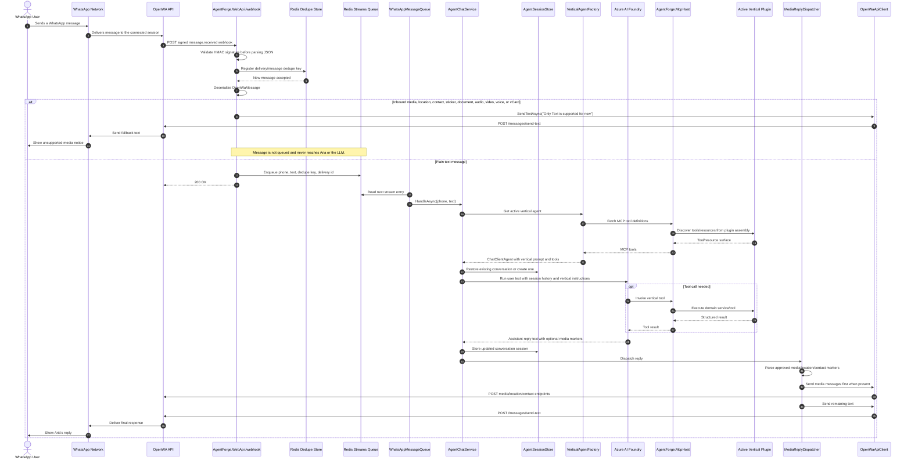

# AgentForge Architecture

AgentForge is a multi-vertical WhatsApp AI platform. The simplest way to understand it is to follow one user message from WhatsApp, through the platform, into the AI agent and vertical tools, and back to the user as a WhatsApp response.

This page intentionally focuses on the **message journey**. For the class-level vertical plugin contract, see [Vertical Plugin System](vertical-plugin-system.md). For deployment commands, see [Deployment Guide](deployment.md). For the embedded OpenWA gateway source, see [src/OpenWA/README.md](../src/OpenWA/README.md).

## Sequence Diagram



## Entities and Roles

| Entity                           | Role in the journey                                                                                                                                                 |
| -------------------------------- | ------------------------------------------------------------------------------------------------------------------------------------------------------------------- |
| **WhatsApp User**                | Sends the original message and receives the final response.                                                                                                         |
| **WhatsApp Network**             | Delivers messages between the user's phone and the connected OpenWA session.                                                                                        |
| **OpenWA API**                   | Self-hosted WhatsApp gateway. Receives WhatsApp events, emits signed webhooks, and exposes send endpoints for text, media, location, contact, and sticker messages. |
| **AgentForge.WebApi `/webhook`** | Public AI gateway endpoint. Validates webhook signatures, performs dedupe registration, blocks unsupported inbound media, and queues plain text messages.           |
| **Redis Dedupe Store**           | Prevents repeated OpenWA deliveries from being processed more than once.                                                                                            |
| **Redis Streams Queue**          | Persists accepted inbound text messages before AI processing so work survives process restarts and can be retried.                                                  |
| **WhatsAppMessageQueue**         | Background worker that reads Redis Stream entries, serializes work per phone number, retries failures, and dead-letters exhausted messages.                         |
| **AgentChatService**             | Runs the conversation loop for one inbound text message. It restores session history, calls the active agent, stores the updated session, and dispatches the reply. |
| **AgentSessionStore**            | Holds client-managed conversation history keyed by phone number.                                                                                                    |
| **VerticalAgentFactory**         | Lazily creates the active `ChatClientAgent` using the vertical descriptor, Azure chat client, and MCP tools.                                                        |
| **Azure AI Foundry**             | LLM provider backing Aria's reasoning and response generation.                                                                                                      |
| **AgentForge.McpHost**           | Generic MCP server. It publishes the active vertical's tools/resources over Streamable HTTP.                                                                        |
| **Active Vertical Plugin**       | Owns business behavior: prompt, customer profile, MCP tools, resources, data, assets, and scheduled-action handling. The in-tree vertical is travel.                |
| **MediaReplyDispatcher**         | Parses Aria's reply for approved outbound media markers, sends media/location/contact messages first, then sends the remaining text.                                |
| **OpenWaApiClient**              | Typed client used by WebApi to call OpenWA send endpoints safely.                                                                                                   |

## What Happens for Plain Text

1. The customer sends a normal WhatsApp text message.
2. OpenWA posts a signed webhook to `AgentForge.WebApi`.
3. WebApi verifies the HMAC signature before parsing the body.
4. WebApi registers a dedupe key in Redis.
5. WebApi confirms the message is plain text and writes it to the Redis Streams queue.
6. `WhatsAppMessageQueue` reads the queued item and calls `AgentChatService`.
7. `AgentChatService` restores the customer's session history.
8. `VerticalAgentFactory` provides Aria, configured from the active vertical descriptor and MCP tools.
9. Azure AI Foundry generates the response, optionally calling MCP tools from the active vertical.
10. `MediaReplyDispatcher` sends any approved outbound media first, then sends the text response.
11. OpenWA delivers the final WhatsApp reply back to the customer.

## What Happens for Inbound Media

Inbound media understanding is intentionally guarded for now. If a user sends an image, video, audio, voice note, document, sticker, location, contact, or vCard, WebApi responds with exactly:

```text
Only Text is supported for now
```

That message is not queued, and no caption or media metadata is sent to Aria or the LLM. Full inbound media understanding is tracked in [GitHub issue #10](https://github.com/goldytech/whatsapp-ai-travel-agent/issues/10).

## Outbound Media

Outbound media is supported through explicit markers returned by the active vertical's tools or prompt-controlled responses. Examples:

| Marker              | Result                    |
| ------------------- | ------------------------- | ------------------------- | -------------------------- |
| `{{image:url        | caption}}`                | Sends a WhatsApp image.   |
| `{{video:url        | caption}}`                | Sends a WhatsApp video.   |
| `{{audio:url        | filename}}`               | Sends WhatsApp audio.     |
| `{{document:url     | filename                  | caption}}`                | Sends a WhatsApp document. |
| `{{sticker:url}}`   | Sends a WhatsApp sticker. |
| `{{location:lat,lng | label                     | address}}`                | Sends a WhatsApp location. |
| `{{contact:name     | phone}}`                  | Sends a WhatsApp contact. |

File-like media must resolve to approved vertical assets under the active vertical asset prefix. This keeps outbound media controlled by the vertical instead of allowing arbitrary model-generated URLs.

## Platform Boundaries

| Layer                       | Owns                                                                                                                                           |
| --------------------------- | ---------------------------------------------------------------------------------------------------------------------------------------------- |
| **AgentForge.AppHost**      | Aspire orchestration, OpenWA, Redis, PostgreSQL, WebApi, McpHost, DevTunnel, MCP Inspector, and publish-time Compose shape.                    |
| **AgentForge.WebApi**       | Webhook ingestion, dedupe, queueing, agent execution, outbound sending, media dispatch, vertical asset serving, and scheduled action dispatch. |
| **AgentForge.McpHost**      | MCP transport and discovery of the active vertical's tools/resources.                                                                          |
| **External vertical plugin** | Domain-specific prompts, tools, resources, data, assets, customer config, and scheduled action behavior.                                      |
| **OpenWA**                  | WhatsApp session management, webhook delivery, REST send endpoints, dashboard, and provider-side persistence.                                  |

## Current Reference Vertical

The external [AgentForge.Verticals.Travel](https://github.com/qloop-tech/AgentForge.Verticals.Travel) repo demonstrates the extension model:

- `TravelVerticalPlugin` implements the plugin entry point.
- `TravelMcpRegistrar` exposes the travel tools/resources assembly.
- `ResolvedTravelVerticalDescriptor` composes the runtime agent prompt and metadata.
- `Configuration/customer-profile.json` and `Configuration/prompt.md` control customer-facing behavior.
- `Data/` contains package, destination, hotel, FAQ, policy, and promotion data.
- `Assets/` contains approved outbound media.
- `Tools/` contains MCP tools Aria can call.

The same host runtime can load another industry vertical by implementing the shared contracts from the `AgentForge.Verticals.Abstractions` NuGet package.
