# Vertical Plugin System

This document explains how AgentForge loads and runs an industry vertical at runtime using the
actual classes and APIs in the codebase today.

For the end-to-end message flow across webhook, queueing, AI, media, and OpenWA, see the [Architecture guide](Architecture.md).

AgentForge is split into two layers:

- a **generic platform runtime** that owns hosting, WhatsApp transport, AI orchestration, and MCP transport
- a **vertical plugin** that owns domain-specific tools, resources, prompt/config composition, and scheduled actions

The current in-tree reference implementation is `AgentForge.Verticals.Travel`, but both
`AgentForge.McpHost` and `AgentForge.WebApi` are already built to consume any vertical that
implements the shared contracts in `AgentForge.Verticals.Abstractions`.

## Runtime view

```mermaid
flowchart TD
    subgraph AppHost["AgentForge.AppHost"]
        AH["Aspire resource graph\nOpenWA, WebApi, McpHost,\nPostgreSQL, Redis, DevTunnel"]
    end

    subgraph Hosts["Runtime hosts"]
        subgraph WebApi["AgentForge.WebApi"]
            WPF["VerticalPluginLoaderFactory.Create(...)"]
            WPL["IVerticalPluginLoader.Load()"]
            WCFG["IVerticalPlugin.ConfigureConfiguration(...)"]
            WCS["IVerticalPlugin.RegisterCommonServices(...)"]
            WWS["IVerticalPlugin.RegisterWebApiServices(...)"]
            WDESC["IVerticalPlugin.CreateDescriptor(...)"]
            VAF["VerticalAgentFactory.GetAgentAsync(...)"]
            SCH["SchedulerService -> IScheduledActionHandler.HandleAsync(...)"]
        end

        subgraph McpHost["AgentForge.McpHost"]
            MPF["VerticalPluginLoaderFactory.Create(...)"]
            MPL["IVerticalPluginLoader.Load()"]
            MCFG["IVerticalPlugin.ConfigureConfiguration(...)"]
            MCS["IVerticalPlugin.RegisterCommonServices(...)"]
            MMCP["IVerticalMcpRegistrar.RegisterServices(...)"]
            MTOOLS["AddMcpServer()\n.WithToolsFromAssembly(...)\n.WithResourcesFromAssembly(...)\n.MapMcp('/mcp')"]
        end
    end

    subgraph Hosting["AgentForge.Verticals.Hosting"]
        FACTORY["VerticalPluginLoaderFactory"]
        DFLT["DefaultVerticalPluginLoader"]
        ALC["AlcVerticalPluginLoader"]
    end

    subgraph Plugin["Active vertical plugin assembly"]
        TVP["TravelVerticalPlugin\n: IVerticalPlugin"]
        TMR["TravelMcpRegistrar\n: IVerticalMcpRegistrar"]
        TVD["ResolvedTravelVerticalDescriptor\n: IVerticalDescriptor"]
        TCFG["TravelConfigurationFiles"]
        TSH["TravelScheduledActionHandler\n: IScheduledActionHandler"]
        TMCP["Travel MCP tools/resources\nfrom Travel assembly"]
    end

    subgraph External["External systems"]
        AI["Azure AI Foundry\nChat completions"]
        OWA["OpenWA"]
    end

    AH --> WebApi
    AH --> McpHost
    WPF --> FACTORY
    MPF --> FACTORY
    FACTORY --> DFLT
    FACTORY --> ALC
    WPL --> TVP
    MPL --> TVP
    WCFG --> TCFG
    MCFG --> TCFG
    WCS --> TVP
    WWS --> TSH
    WDESC --> TVD
    MCS --> TVP
    MMCP --> TMR
    TMR --> TMCP
    MTOOLS --> TMCP
    VAF --> TVD
    VAF --> MTOOLS
    VAF --> AI
    SCH --> TSH
    WebApi --> OWA
```

## Core contracts

The plugin boundary lives in `src/AgentForge.Verticals.Abstractions/VerticalContracts.cs`.

| Contract | Actual members used today | Purpose |
|---|---|---|
| `IVerticalPlugin` | `McpRegistrar`, `ConfigureConfiguration(IConfigurationManager)`, `RegisterCommonServices(IServiceCollection)`, `RegisterWebApiServices(IServiceCollection)`, `CreateDescriptor(IServiceProvider)`, `ResolveMcpServerName(IConfiguration)` | Main entry point for both hosts. It owns configuration layering, shared DI registrations, WebApi-only DI registrations, runtime descriptor creation, and MCP server naming. |
| `IVerticalMcpRegistrar` | `Assembly McpAssembly`, `RegisterServices(IServiceCollection)` | Tells `AgentForge.McpHost` which assembly contains tools/resources and which MCP-facing services should be registered before discovery. |
| `IVerticalDescriptor` | `VerticalId`, `DisplayName`, `AgentName`, `AgentDescription`, `SystemPrompt`, `McpServerName`, `AssetPathPrefix`, `PreviewTitle`, `PreviewDescription` | Runtime-composed metadata consumed by the agent and the generic host surfaces. |
| `IScheduledActionHandler` | `HandleAsync(ScheduledAction, CancellationToken)` | Lets the generic scheduler delegate follow-up/reminder behavior to the active vertical. |
| `IVerticalPluginLoader` | `Load()` | Abstracts how the active vertical plugin is resolved. |
| `IVerticalDeploymentValidator` | `ValidateDeployment()` | Optional hook for plugin assemblies loaded via `AssemblyLoadContext` to fail fast when required deployment files are missing. |
| `IMessageSender` | `SendTextAsync(...)`, `SendImageAsync(...)`, `SendVideoAsync(...)`, `SendAudioAsync(...)`, `SendDocumentAsync(...)`, `SendLocationAsync(...)`, `SendContactAsync(...)`, `SendStickerAsync(...)` | Generic send surface used by WebApi services and vertical handlers without exposing provider-specific APIs. |

## How a vertical is selected

Both `AgentForge.McpHost` and `AgentForge.WebApi` start by calling:

| Step | Class / API | What it does |
|---|---|---|
| 1 | `VerticalPluginLoaderFactory.Create(string? pluginPath, string? pluginRoot, string? verticalId)` | Chooses the loader strategy from configuration. |
| 2 | `DefaultVerticalPluginLoader.Load()` | Returns `new TravelVerticalPlugin()` when no external plugin is configured. |
| 3 | `AlcVerticalPluginLoader.Load()` | Loads an external plugin assembly, finds the first public non-abstract parameterless type implementing `IVerticalPlugin`, instantiates it, and optionally runs `IVerticalDeploymentValidator.ValidateDeployment()`. |

### Loader resolution rules

| Configuration | Loader used | Result |
|---|---|---|
| `VERTICAL_PLUGIN_PATH` set | `AlcVerticalPluginLoader` | Loads a specific DLL or a folder containing exactly one `AgentForge.Verticals.*.dll`. |
| `VERTICAL_PLUGIN_ROOT` and `VERTICAL_ID` set | `AlcVerticalPluginLoader` | Loads `<VERTICAL_PLUGIN_ROOT>/<VERTICAL_ID>`. |
| Neither set | `DefaultVerticalPluginLoader` | Falls back to the in-tree travel vertical. |

### What `AlcVerticalPluginLoader` validates

`AlcVerticalPluginLoader` is responsible for the stricter external-plugin path:

- resolves either a direct DLL path or a plugin directory
- ignores `AgentForge.Verticals.Abstractions.dll` and `AgentForge.Verticals.Hosting.dll` when scanning a folder
- rejects zero or multiple candidate plugin assemblies
- creates the plugin instance with `Activator.CreateInstance(...)`
- runs `ValidateDeployment()` when the plugin also implements `IVerticalDeploymentValidator`

That keeps the generic hosts free from plugin-path heuristics and deployment-file checks.

## How `AgentForge.McpHost` uses the plugin

`src/AgentForge.McpHost/Program.cs` is a thin generic host. It does not know about travel-specific
classes beyond whatever the loader returns.

### Startup flow

| Order | Class / API | Why it exists |
|---|---|---|
| 1 | `VerticalPluginLoaderFactory.Create(...)` | Resolves the active plugin source. |
| 2 | `IVerticalPluginLoader.Load()` | Materializes the `IVerticalPlugin`. |
| 3 | `IVerticalPlugin.ConfigureConfiguration(builder.Configuration)` | Lets the plugin add its own configuration sources before options binding happens. |
| 4 | `builder.Services.AddSingleton<IVerticalPluginLoader>(...)` | Makes the loader available to other generic services if needed. |
| 5 | `builder.Services.AddSingleton<IVerticalPlugin>(...)` | Registers the active plugin as a singleton runtime dependency. |
| 6 | `builder.Services.AddSingleton<IVerticalMcpRegistrar>(...)` | Exposes `plugin.McpRegistrar` to DI. |
| 7 | `builder.Services.AddSingleton<IVerticalDescriptor>(...)` | Builds the runtime descriptor once from `plugin.CreateDescriptor(IServiceProvider)`. |
| 8 | `plugin.RegisterCommonServices(builder.Services)` | Registers plugin-owned shared services and options. |
| 9 | `plugin.McpRegistrar.RegisterServices(builder.Services)` | Registers services needed by MCP tools/resources. |
| 10 | `builder.Services.AddMcpServer(...).WithToolsFromAssembly(plugin.McpRegistrar.McpAssembly).WithResourcesFromAssembly(plugin.McpRegistrar.McpAssembly).WithHttpTransport()` | Auto-discovers the vertical's tools/resources from its assembly and exposes them over Streamable HTTP. |
| 11 | `app.MapMcp("/mcp")` | Publishes the MCP endpoint consumed by the AI agent. |

### Why the MCP host stays generic

`AgentForge.McpHost` never hard-codes:

- specific tool classes
- resource URIs
- travel data services
- travel-specific prompt content

It only needs the plugin contracts plus assembly-based discovery.

## How `AgentForge.WebApi` uses the plugin

`src/AgentForge.WebApi/Program.cs` uses the same loader pattern, but consumes more of the plugin
surface because it owns AI orchestration and scheduled actions.

### Startup flow

| Order | Class / API | Why it exists |
|---|---|---|
| 1 | `VerticalPluginLoaderFactory.Create(...)` | Resolves the active plugin source. |
| 2 | `IVerticalPluginLoader.Load()` | Loads the active `IVerticalPlugin`. |
| 3 | `IVerticalPlugin.ConfigureConfiguration(builder.Configuration)` | Adds plugin configuration sources before the rest of startup continues. |
| 4 | `builder.Services.AddSingleton<IVerticalPlugin>(...)` | Makes the active plugin available to generic services. |
| 5 | `builder.Services.AddSingleton<IVerticalDescriptor>(sp => sp.GetRequiredService<IVerticalPlugin>().CreateDescriptor(sp))` | Produces the runtime descriptor once for the app lifetime. |
| 6 | `plugin.RegisterCommonServices(builder.Services)` | Registers shared plugin services/options used by both hosts. |
| 7 | `plugin.RegisterWebApiServices(builder.Services)` | Registers WebApi-only behavior such as `IScheduledActionHandler`. |
| 8 | `builder.Services.AddSingleton<IAgentFactory, VerticalAgentFactory>()` | Wires the generic agent factory to the active descriptor and MCP tool surface. |

### How the runtime descriptor is consumed

`VerticalAgentFactory` depends on `IVerticalDescriptor` and uses it in
`GetAgentAsync(CancellationToken)` to construct a single `ChatClientAgent` with:

| `IVerticalDescriptor` member | Used for |
|---|---|
| `AgentName` | `ChatClientAgent.name` |
| `AgentDescription` | `ChatClientAgent.description` |
| `SystemPrompt` | `ChatClientAgent.instructions` |

The MCP tool list is loaded separately through `McpClientProvider.GetToolsAsync(...)`, which means
the descriptor and the MCP host are two complementary parts of the same vertical runtime.

### How scheduled actions stay generic

`SchedulerService` does not know travel-specific reminder logic. It only dispatches through
`IScheduledActionHandler.HandleAsync(...)`. The active vertical chooses the implementation by
registering it in `RegisterWebApiServices(IServiceCollection)`.

## Travel vertical walkthrough

The travel vertical is the reference plugin implementation under
`src/Verticals/AgentForge.Verticals.Travel/`.

### Main runtime pieces

| Class | Role in the plugin system |
|---|---|
| `TravelVerticalPlugin` | Implements `IVerticalPlugin` and `IVerticalDeploymentValidator`. It is the main entry point for travel configuration, shared services, WebApi-specific services, descriptor creation, MCP server naming, and deployment validation. |
| `TravelMcpRegistrar` | Implements `IVerticalMcpRegistrar`. It points `McpHost` at the travel assembly and registers `TourCatalogService`, `BookingInquiryService`, `DestinationService`, `HotelService`, `PromotionService`, and `PolicyService`. |
| `ResolvedTravelVerticalDescriptor` | Implements `IVerticalDescriptor`. It converts `TravelCustomerProfileOptions` plus `prompt.md` into the final runtime descriptor used by the agent and previews. |
| `TravelConfigurationFiles` | Adds the bundled `customer-profile.json`, optionally overlays an external `CUSTOMER_CONFIG_PATH`, validates that config files exist, and resolves the prompt file path safely. |
| `TravelScheduledActionHandler` | Implements `IScheduledActionHandler` and sends the travel-specific follow-up/reminder messages using the generic `IMessageSender`. |

### `TravelVerticalPlugin` responsibilities

| Method / property | What it does |
|---|---|
| `McpRegistrar` | Returns `new TravelMcpRegistrar()`. |
| `ConfigureConfiguration(IConfigurationManager)` | Calls `TravelConfigurationFiles.AddConfigurationSources(...)` so the plugin can layer bundled and external customer config before option binding. |
| `RegisterCommonServices(IServiceCollection)` | Registers travel option validation and binds `TravelCustomerProfileOptions`. |
| `RegisterWebApiServices(IServiceCollection)` | Registers `IScheduledActionHandler` as `TravelScheduledActionHandler`. |
| `CreateDescriptor(IServiceProvider)` | Reads `TravelCustomerProfileOptions`, resolves the prompt path, loads `prompt.md`, and returns `ResolvedTravelVerticalDescriptor`. |
| `ResolveMcpServerName(IConfiguration)` | Delegates to `TravelCustomerProfileBinder.ResolveRequiredMcpServerName(...)`. |
| `ValidateDeployment()` | Ensures the travel data and configuration folders exist before the external plugin is used. |

### How the travel descriptor is composed

`ResolvedTravelVerticalDescriptor` builds the final runtime shape from strongly typed customer
options plus the prompt file.

| Descriptor member | Travel source |
|---|---|
| `VerticalId` | hard-coded to `"travel"` |
| `DisplayName` | `TravelCustomerProfileOptions.DisplayName` |
| `AgentName` | `TravelCustomerProfileOptions.AgentName` |
| `AgentDescription` | `TravelCustomerProfileOptions.AgentDescription` |
| `McpServerName` | `TravelCustomerProfileOptions.McpServerName` |
| `AssetPathPrefix` | `TravelCustomerProfileOptions.AssetPathPrefix` |
| `PreviewTitle` | `TravelCustomerProfileOptions.PreviewTitle` |
| `PreviewDescription` | `TravelCustomerProfileOptions.PreviewDescription` |
| `SystemPrompt` | bundled `prompt.md` plus runtime customer-profile fields appended by `BuildSystemPrompt(...)` |

### How customer config overrides work

`TravelConfigurationFiles` is what makes customer onboarding configurable without recompiling.

| API | Behavior |
|---|---|
| `AddConfigurationSources(IConfigurationManager)` | Loads the bundled `Configuration/customer-profile.json`, then overlays `CUSTOMER_CONFIG_PATH/customer-profile.json` when present. |
| `ResolvePromptPath(IConfiguration, string)` | Prefers an external prompt file from `CUSTOMER_CONFIG_PATH`, otherwise falls back to the bundled prompt. |
| `EnsureDefaultFilesExist()` | Fails fast if bundled config files are missing. |

This is why both hosts call `plugin.ConfigureConfiguration(...)` before the rest of startup.

## End-to-end runtime sequence

| Phase | Main classes / APIs | What happens |
|---|---|---|
| Plugin resolution | `VerticalPluginLoaderFactory`, `DefaultVerticalPluginLoader`, `AlcVerticalPluginLoader` | The active plugin is chosen from env vars or the in-tree fallback. |
| Configuration layering | `IVerticalPlugin.ConfigureConfiguration(...)`, `TravelConfigurationFiles` | Plugin-owned config sources are added before options are bound. |
| DI registration | `RegisterCommonServices(...)`, `RegisterWebApiServices(...)`, `IVerticalMcpRegistrar.RegisterServices(...)` | Shared, WebApi-only, and MCP-only services are registered in the appropriate host. |
| Descriptor creation | `IVerticalPlugin.CreateDescriptor(...)`, `ResolvedTravelVerticalDescriptor` | The generic runtime gets the vertical's final prompt/branding/preview metadata. |
| MCP surface publication | `AddMcpServer(...)`, `WithToolsFromAssembly(...)`, `WithResourcesFromAssembly(...)`, `MapMcp("/mcp")` | MCP tools and resources from the plugin assembly become remotely callable. |
| Agent materialization | `VerticalAgentFactory.GetAgentAsync(...)` | The `ChatClientAgent` is created with descriptor metadata and MCP tools fetched from `AgentForge.McpHost`. |
| Scheduled actions | `SchedulerService`, `IScheduledActionHandler.HandleAsync(...)`, `TravelScheduledActionHandler` | Generic scheduling delegates the business-specific behavior back to the active vertical. |

## Authoring a new vertical

To create a new vertical library under `src/Verticals/AgentForge.Verticals.<Vertical>/`, the
minimum moving pieces are:

| Required piece | What to implement |
|---|---|
| Plugin entry point | A class implementing `IVerticalPlugin` |
| MCP registrar | A class implementing `IVerticalMcpRegistrar` |
| Runtime descriptor | A class implementing `IVerticalDescriptor` |
| Scheduled actions | A class implementing `IScheduledActionHandler` if the vertical needs reminders/follow-ups |
| Config layering | A helper similar to `TravelConfigurationFiles` if the vertical supports bundled plus external config |
| Validation | `IVerticalDeploymentValidator` when the published plugin depends on external files/folders |

### Practical checklist

1. Create the vertical project under `src/Verticals/AgentForge.Verticals.<Vertical>/`.
2. Implement `IVerticalPlugin` and expose an `IVerticalMcpRegistrar`.
3. Put the vertical's MCP tools and resources in the same assembly returned by `McpAssembly`.
4. Register all MCP-side services in `IVerticalMcpRegistrar.RegisterServices(...)`.
5. Register WebApi-only services in `IVerticalPlugin.RegisterWebApiServices(...)`.
6. Build an `IVerticalDescriptor` from strongly typed config and prompt files.
7. Publish the plugin and point `VERTICAL_PLUGIN_PATH` or `VERTICAL_PLUGIN_ROOT` + `VERTICAL_ID` at it.

That is the complete plugin loop: the hosts stay generic, while the vertical assembly becomes the
source of business behavior, MCP capabilities, and runtime agent identity.
