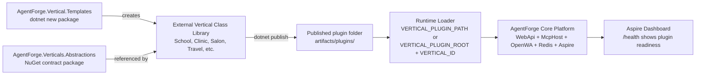

# Vertical Plugin System

AgentForge's core product idea is simple: the WhatsApp, AI, queueing, health, and hosting runtime stays generic, while each customer or industry ships as an external vertical plugin.

For the end-to-end user message journey, see [Architecture](Architecture.md). For a hands-on tutorial, see [Plugin Development Getting Started](plugin-development-getting-started.md).

## High-Level Model



## What Belongs Where

| Layer | Owns |
|---|---|
| **Core platform** | OpenWA transport, signed webhooks, Redis Streams queueing, AI orchestration, MCP hosting, outbound sending, media safety, health checks, deployment wiring. |
| **Contract package** | Stable interfaces such as `IVerticalPlugin`, `IVerticalDescriptor`, `IVerticalMcpRegistrar`, `IScheduledActionHandler`, and scheduled message intent records. |
| **External vertical plugin** | Prompt, customer profile/config, MCP tools/resources, domain data, domain services, assets, scheduled message content. |
| **Template package** | Best-practice project scaffold installed with `dotnet new install AgentForge.Vertical.Templates`. |

Vertical plugins do **not** reference `AgentForge.WebApi`, `AgentForge.McpHost`, OpenWA, or core sender implementations. The vertical defines business behavior; the core platform sends messages and owns provider behavior.

## Runtime Loading

`AgentForge.WebApi` and `AgentForge.McpHost` both resolve the same active plugin using one of these configurations:

| Configuration | Result |
|---|---|
| `VERTICAL_PLUGIN_PATH=/path/to/plugin.dll` | Loads that exact plugin assembly. |
| `VERTICAL_PLUGIN_PATH=/path/to/plugin-folder` | Loads the single `AgentForge.Verticals.*.dll` in that folder. |
| `VERTICAL_PLUGIN_ROOT=/app/plugins` + `VERTICAL_ID=school` | Loads `/app/plugins/school`. |

If no plugin is configured, the folder is missing, no candidate DLL exists, multiple candidate DLLs exist, dependencies cannot be resolved, or no public parameterless `IVerticalPlugin` implementation exists, the host stays running but reports `Unhealthy` on `/health`.

There is no hidden default Travel fallback in the core runtime path. Travel can exist as a sample external plugin, but the core platform expects an explicit plugin configuration.

## Health and Aspire Dashboard Behavior

Both `webhook` and `mcpserver` are configured with Aspire health checks against `/health`.

| Endpoint | Meaning |
|---|---|
| `/health` | Readiness. Includes the `vertical-plugin` check and becomes `Unhealthy` when plugin bootstrap fails. |
| `/alive` | Liveness. Remains healthy when the process is alive, even if the plugin is missing. |

When plugin bootstrap fails:

- startup logs include the exact expected configuration path
- `/health` returns an unhealthy `vertical-plugin` entry with the bootstrap error
- Aspire Dashboard shows WebApi and McpHost as unhealthy
- WebApi returns `503 Service Unavailable` for `/webhook`
- McpHost does not expose a fake MCP tool surface

## Required Plugin Contracts

External plugin projects reference `AgentForge.Verticals.Abstractions` and implement:

| Contract | Purpose |
|---|---|
| `IVerticalPlugin` | Main plugin entry point for configuration, DI registrations, descriptor creation, and MCP registrar access. |
| `IVerticalDescriptor` | Runtime identity: vertical id, display name, agent name/description, system prompt, MCP server name, asset prefix/root, preview metadata. |
| `IVerticalMcpRegistrar` | Points McpHost at the assembly containing tools/resources and registers services needed by those tools. |
| `IVerticalDeploymentValidator` | Optional fail-fast validation for required config/data/assets in the published plugin bundle. |
| `IScheduledActionHandler` | Optional scheduled business behavior. Returns message content/intents; core platform sends them. |

## Message Sending Boundary

`IMessageSender` is part of the core WebApi implementation, not the public plugin contract package.

Plugins must not call OpenWA or send WhatsApp messages directly. If a vertical needs scheduled reminders, it returns message content:

```csharp
return
[
    new ScheduledMessage(action.ChatId, "Your school fee reminder is due tomorrow.")
];
```

The core scheduler then sends those messages through the configured provider. This keeps retry rules, provider APIs, media dispatch, and security policies in the core platform.

## Published Plugin Folder

A published plugin folder should contain:

```text
artifacts/plugins/school/
├── AgentForge.Verticals.School.dll
├── AgentForge.Verticals.School.deps.json
├── dependency assemblies...
├── Configuration/
├── Data/
└── Assets/
```

The loader uses `AssemblyDependencyResolver`, so dependencies copied beside the plugin are resolved from the plugin bundle.
